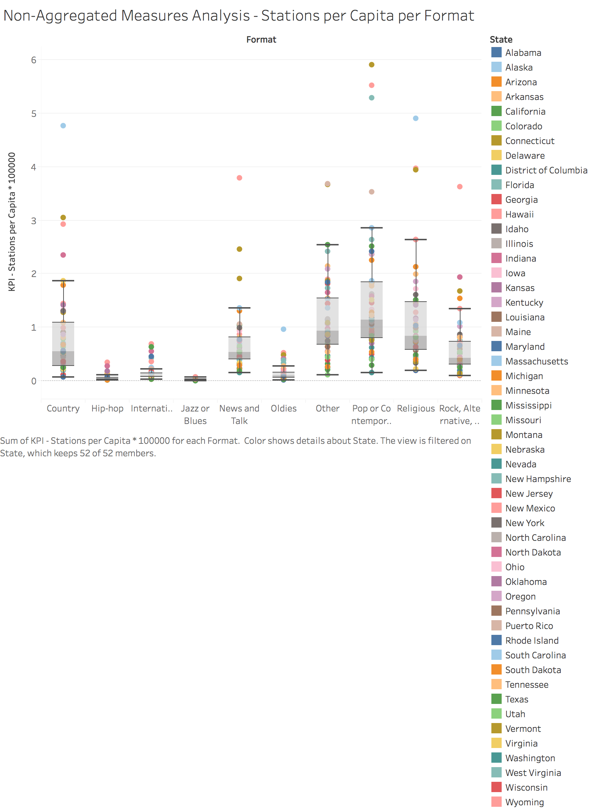
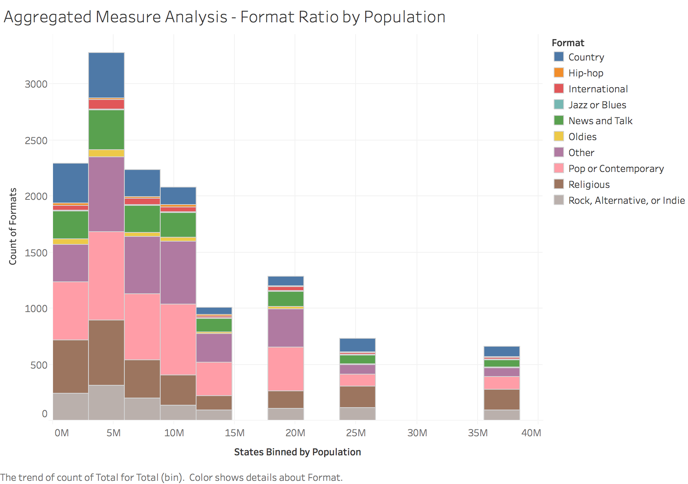
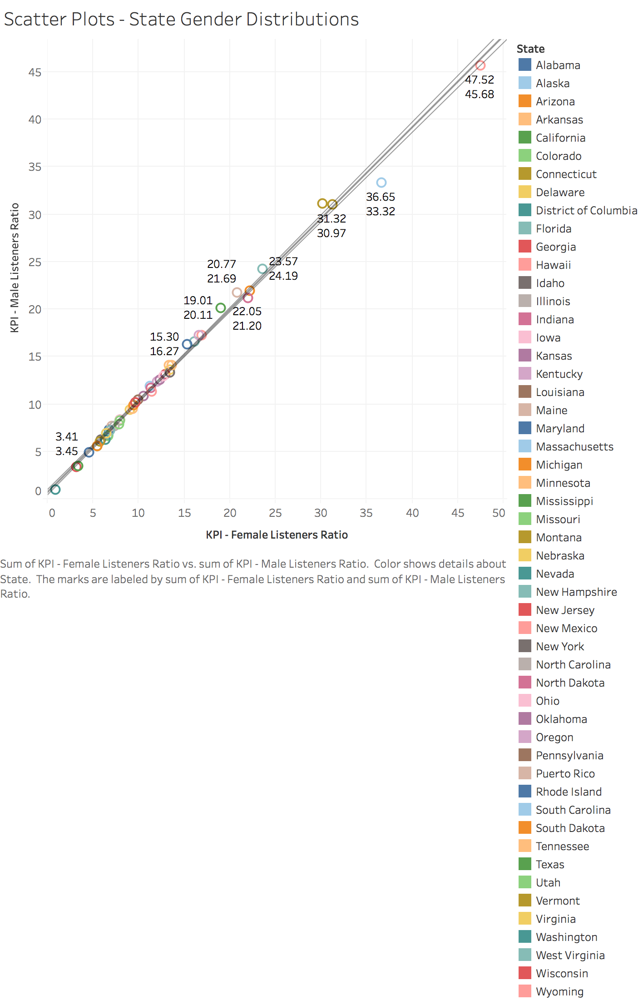

## Final Project

The focus of our projects have been around joining data from radio stations around the country with census data. We have a list of every radio station in the United States and information about it, as well as the census data from `data.world`.

### Important Links
* [Shiny app](https://ianmobbs.shinyapps.io/final/)
* [data.world](https://data.world/jacobv/s-17-dv-final-project)
* [Github](https://github.com/CannataUTDV/s17dvfinalproject-mobbs-vanderlinden-kong-rahbar)

## ETL Script

```{r, code = readLines("../01 Data/ETL.R"), eval=FALSE}
```

### Radio Station Data

Our radio station data is 13,627 radio stations from across the United States. For each station, we have the Callsign, Frequency, City, State, Licensee, and Format. The format has been standardized from each stations self-described format to be one of the following formats: Religious, Pop or Contemporary, Rock or Alternative or Indie, Country, Hip-hop, Jazz or Blues, International, Oldies, News and Talk, or Other.

### Census Data

We're using stock census data, with some slight modifications. We have each state, it's total population, male population, female population, 2016 political party affiliation, and a custom Coast column that's either "West", "East", or "None".

## KPIs

### Adj. Stations per Capita

Calculated as the `100,000 * ([Number of Stations] / [Total Population])`

### Adj. Male Listeners per Capita

Calculated as the `100,000 * ([Number of Stations] / [Male Population])`

### Adj. Female Listeners per Capita

Calculated as the `100,000 * ([Number of Stations] / [Female Population])`

## Non-Aggregated Measures Analysis

Our non-aggregated measures analysis is a box-and-whiskers plot. The columns are each Format, the rows are an adjusted Stations per Capita, and the data points are each state. This is an interesting way to view the relative frequencies of each format and a simple way to find outliers of states for each format. For example, Washington D.C. has an abnormally large amount of News and Talk radio stations (third data point from the top of News and Talk).

### Tableau



### Shiny


## Aggregated Measures Analysis

Our aggregated measures analysis in Tableau is a histogram. We bin states by their total population, and count the amount of radio stations that belong to states in each bin. This allows us to see the relative frequency of station formats in smaller and larger states. For example, Religious radio stations (brown) become increasingly less popular as state size increases.

### Tableau


### Shiny

The aggregated measures analysis in Shiny is a bar plot. The total number of radio stations for each state with the color showing the formats of the stations. States populations are shown in the X axis in units of 1 million. The general trend shows that the number of radio stations increases with population.


## Scatter Plots

Our scatter plots compare the amount of female listeners per capita to the amount of male listeners per capita. Here we can easily visualize each states relative male and female population for the amount of stations in the state.

### Tableau



### Shiny


## Crosstabs

Crosstabs were really the first assignment where we utilized our listener KPIs. We created several crosstabs that allowed us to visualize the amount of listeners per capita for each format for each state. The listeners per capita were divided into three demographics - total, male, and female. This is an interesting way to see which formats are more popular among the different sexes.

1. Stations per Capita
  + Perfect example of [Simpson's Paradox](https://en.wikipedia.org/wiki/Simpson%27s_paradox). Country music stations in Wyoming appear to be average, until you observe the same ratio for both Male and Female listeners, where it appears to be high.
2. Male Listeners per Capita
  + Mississippi has a higher ratio of male listeners for Pop and Contemporary stations than female listeners.
3. Female Listeners per Capita
  + Alaska has a higher ratio of female listeners for Pop and Contemporary stations than male listeners.

### Tableau

1. 
2. 
3. 

### Shiny

1. 
2. 
3. 

## Barcharts

1. Formats by State
  + Our Formats by State barchart allowed us to see the relative amount of formats for each state. This allowed us to easily see the difference in musical preferences for each state.
  + You can see in our barchart for Texas that Religious stations are by far the most prevalent within the state. This could be for a number of reasons - maybe Texas is highly religious? Maybe religious stations are more likely to stay in business because it's a cheaper form of 'distribution'? More data would be required to provide that insight.
2. East Coast vs West Coast Music Preferences
  + The [East Coast - West Coast hip hop rivalry](https://en.wikipedia.org/wiki/East_Coast%E2%80%93West_Coast_hip_hop_rivalry) is one of the best known in music. Popularized by the feud between Tupac and The Notorious B.I.G., the 90s were consumed by hip hop heads debating which coast was better. Here, we can see that hip hop has all but fallen off the map in both California and New York. Actually looking at the data, however, shows us that California has 0.0182 hip hop stations per capita but New York has 0.0203 hip hop stations per capita. Biggie wins!
3. Conservative vs Liberal State Music Preferences
  + More of an interesting thought experiment than anything, we thought it'd be neat to see the difference in music preferences between notoriously
  conservative states and notoriously liberal states. While our visualizations show the differences between Arkansas and Washington, our Shiny app allows you to pick between Democratic and Republican states (labelled by how they voted in the 2016 election). There are stark differences here, most notably the vast popularity of religious music in Arkansas.

### Tableau

1. .png)
2. 
3. 

### Shiny

1. .png)
2. 
3. 